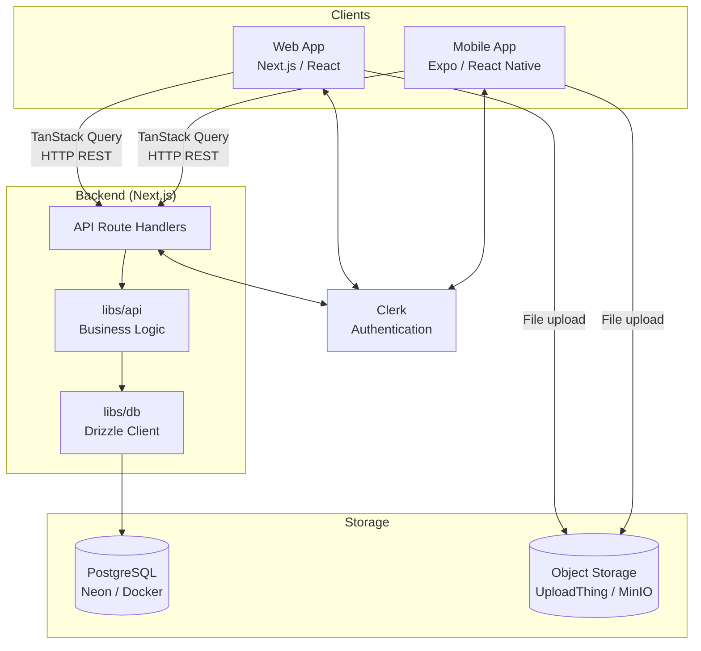
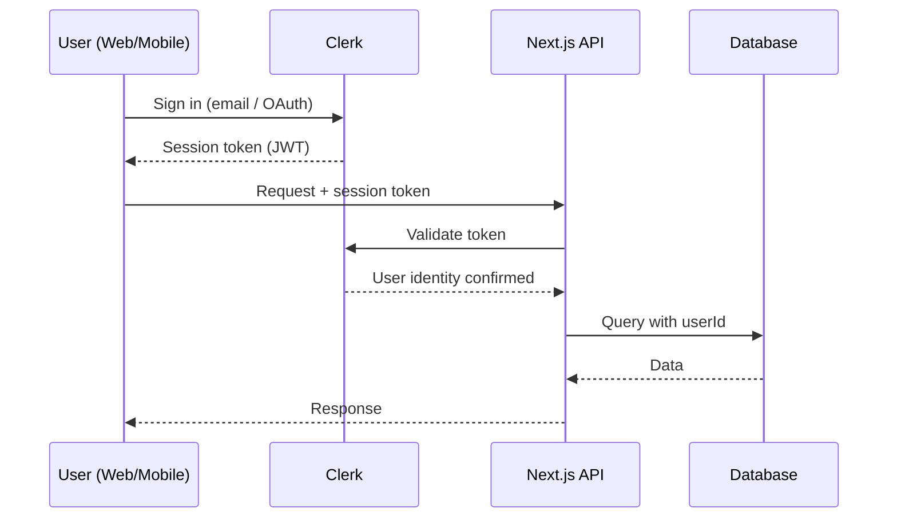
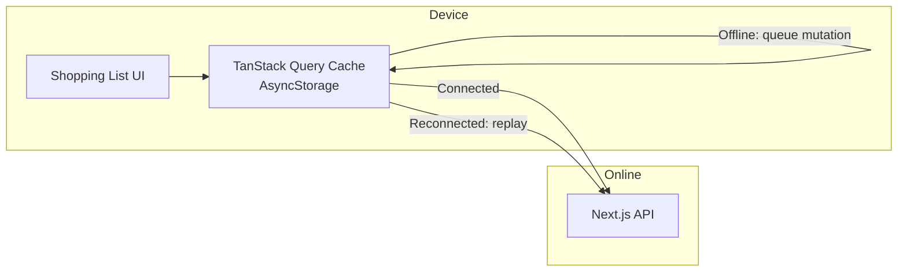
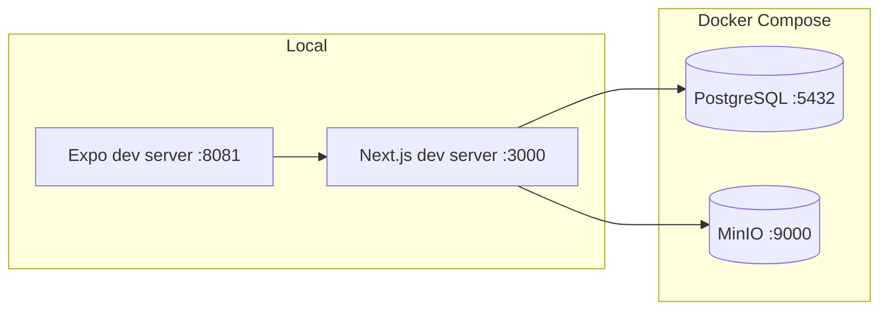

# FitFam — Architecture

## Overview

FitFam is a full-stack family wellness application delivered as a web app and a mobile app, sharing a single backend. All code lives in a monorepo managed by Nx.

---

## Monorepo Structure

```
fit-fam/
├── apps/
│   ├── web/          # Next.js web application
│   └── mobile/       # Expo / React Native mobile application
└── libs/
    ├── api/          # Business logic and service layer
    ├── db/           # Drizzle ORM schema and database client
    ├── types/        # Shared TypeScript interfaces and DTOs
    └── i18n/         # Shared translation strings (EN + PL)
```

### Library responsibilities

| Library | Responsibility |
|---|---|
| `libs/api` | All business logic (meal planning, shopping list calculation, recipe management, etc.). Consumed exclusively by Next.js API route handlers. Framework-agnostic. |
| `libs/db` | Drizzle schema definitions, migration files, and the database client instance. |
| `libs/types` | TypeScript interfaces, DTOs, and enums shared between web, mobile, and API. |
| `libs/i18n` | Translation JSON files for English (`en`) and Polish (`pl`). Consumed by `next-intl` (web) and `expo-localization` (mobile). |

---

## Tech Stack

### Web (`apps/web`)

| Concern | Technology |
|---|---|
| Framework | Next.js (App Router) |
| Language | TypeScript |
| UI components | shadcn/ui |
| Styling | Tailwind CSS |
| Data fetching | TanStack Query (React Query) |
| Internationalization | next-intl |
| Auth (client) | Clerk (React SDK) |

### Mobile (`apps/mobile`)

| Concern | Technology |
|---|---|
| Framework | Expo (React Native) |
| Language | TypeScript |
| UI components | React Native (per-app component library) |
| Data fetching | TanStack Query (React Query) |
| Offline persistence | TanStack Query + AsyncStorage persister |
| Internationalization | expo-localization + i18n-js |
| Auth (client) | Clerk (Expo SDK) |

### Backend (`libs/api` + Next.js API routes)

| Concern | Technology |
|---|---|
| API layer | Next.js API route handlers |
| Business logic | `libs/api` (framework-agnostic TypeScript) |
| ORM | Drizzle ORM |
| Database | PostgreSQL |
| Auth (server) | Clerk (Next.js SDK) |
| AI (v2+) | Vercel AI SDK |
| File uploads | UploadThing |

### Infrastructure

| Concern | Production | Local Development |
|---|---|---|
| Database | Neon (serverless PostgreSQL) | Docker Compose (PostgreSQL) |
| File storage | UploadThing | MinIO (Docker Compose, S3-compatible) |
| Auth | Clerk (managed) | Clerk (dev instance) |
| App hosting | TBD (Vercel / Railway / Fly.io / self-hosted) | Local Next.js dev server |
| Monorepo | Nx | Nx |

---

## Data Flow



Both web and mobile call the same Next.js API routes. Business logic is never duplicated in the clients — it lives exclusively in `libs/api`.

---

## Authentication Flow



- Adult family members authenticate via Clerk (email/password, magic link, Google, Apple).
- Child profiles have no authentication — managed by authenticated adults.
- Family membership and role are stored in the application database, not in Clerk metadata.

---

## Internationalization

- Supported languages at launch: **English (en)** and **Polish (pl)**.
- Language is a **family-level setting** — all members of a family see the same language.
- Translation strings live in `libs/i18n`, shared between web and mobile.
- Web uses `next-intl`; mobile uses `expo-localization` + `i18n-js`.
- Ingredient names are user-generated content — stored as-is, not translated automatically in v1.

---

## Offline Support (Mobile)



- Only the **shopping list** is offline-capable in v1.
- Check-off mutations are queued offline and replayed on reconnect.
- All other features require network connectivity.

---

## Local Development Environment



| Service | Image | Purpose |
|---|---|---|
| PostgreSQL | `postgres:16` | Application database |
| MinIO | `minio/minio` | S3-compatible local file storage |

Next.js and Expo run natively outside Docker and connect to Dockerized services via environment variables.
