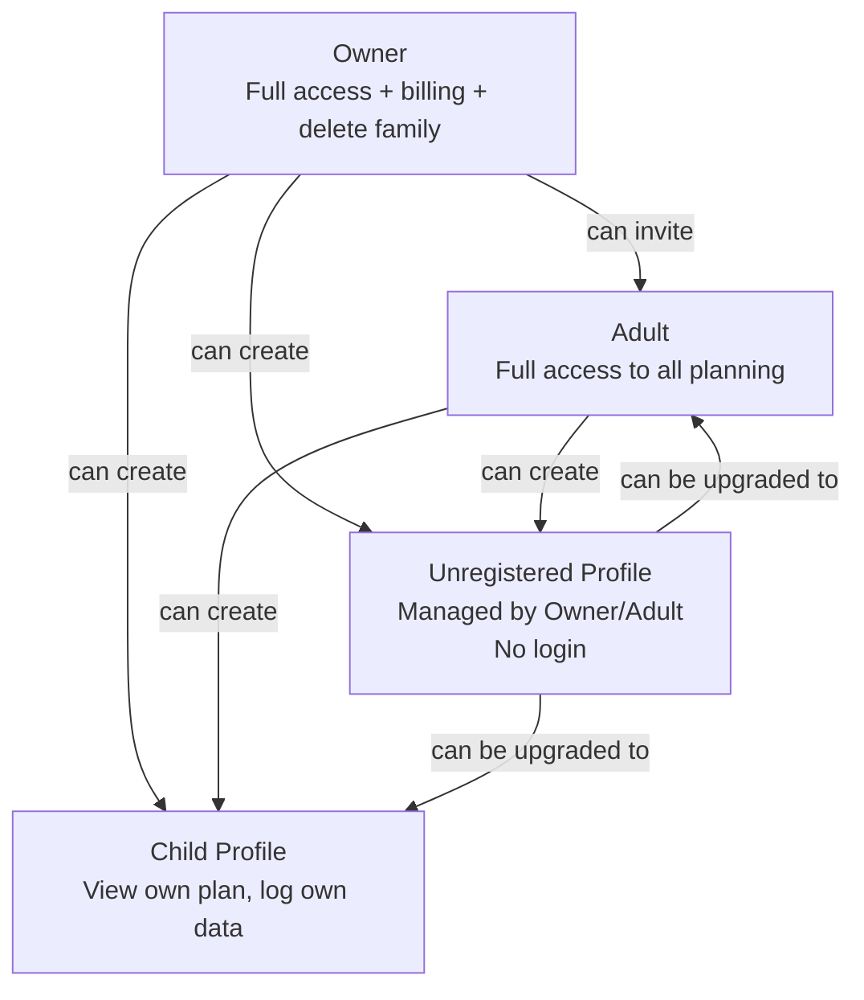
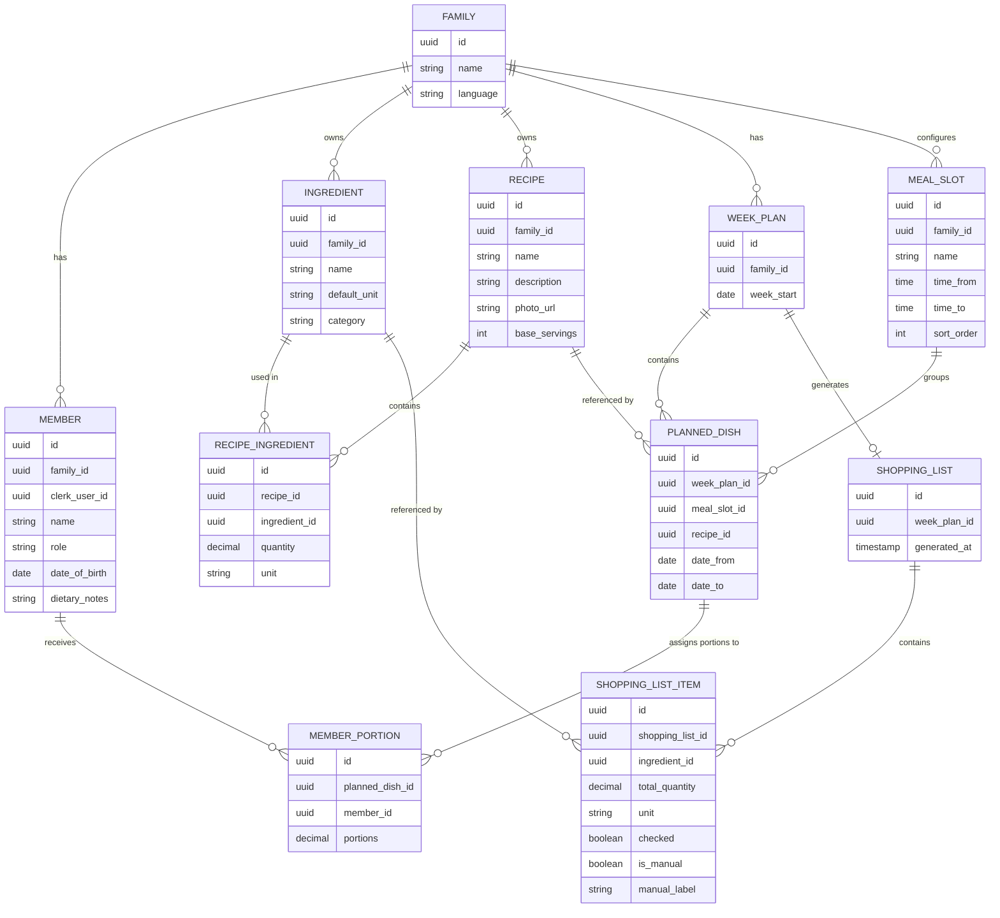

# FitFam — Entities

## User Roles

### Owner
- Created when the family group is first set up.
- Has all Adult permissions plus: billing management, family deletion, and family settings (language, slot configuration).
- Exactly one Owner per family.

### Adult
- Invited via email or added as a managed profile that later created an account.
- Full read/write access to: meal plans, recipes, ingredient library, shopping list, activity plans — for any family member.
- Can add/edit/remove other profiles (but cannot remove the Owner).

### Child Profile _(v5)_
- A family member with their own login (age-gated, parental consent required).
- Can view their own meal and activity plan.
- Can log their own activity completion and meal check-offs.
- Cannot edit other members' data or access family settings.

### Unregistered Profile
- A lightweight family member record (name, age, dietary notes) with no login.
- Created and fully managed by an Owner or Adult.
- Can be upgraded to a full account (Adult or Child) at any time.
- Default member type — a family can operate entirely with one authenticated user managing all profiles.

---

## Core Data Entities

---

## Entity Descriptions

### Family
The top-level container. Everything belongs to a family. Has one language setting applied to all members.

### Member
Represents a person in the family. May or may not have a Clerk account (`clerk_user_id` is nullable for unregistered profiles). Holds role, basic personal info, and dietary notes.

### Ingredient
A reusable ingredient in the family's ingredient library. Has a name, default unit, and a category used for shopping list grouping. Pre-seeded with common ingredients; families extend it over time.

### Recipe
A family recipe with a name, optional description and photo, and a base serving count. Contains a list of `RecipeIngredient` records that define the ingredients and quantities for the base serving count.

### RecipeIngredient
A join between a Recipe and an Ingredient, carrying the quantity and unit for that specific recipe. The unit on RecipeIngredient may differ from the Ingredient's default unit.

### MealSlot
A named meal period in the day (e.g. Breakfast, Lunch, Dinner). Defined at the family level and shared across all week plans. Has an optional time window and a sort order. Families can rename, add, or remove slots.

### WeekPlan
One week's meal plan for the family, identified by its Monday date. A family has at most one WeekPlan per week.

### PlannedDish
A dish scheduled in a WeekPlan. References a Recipe and a MealSlot. Spans a date range (`date_from` → `date_to`) to support batch cooking. Has one or more MemberPortions defining who eats it and how much.

### MemberPortion
Assigns a specific number of portions of a PlannedDish to a family member. Used by the shopping list calculator to scale ingredient quantities correctly.

### ShoppingList
Auto-generated from a WeekPlan. Aggregates all PlannedDish ingredients across all days, scaled to total portions per ingredient. Regenerated on demand when the meal plan changes.

### ShoppingListItem
One line on the shopping list. Either generated (linked to an Ingredient with a calculated total quantity) or manual (freeform label added by the user). Carries a `checked` flag toggled while shopping.
