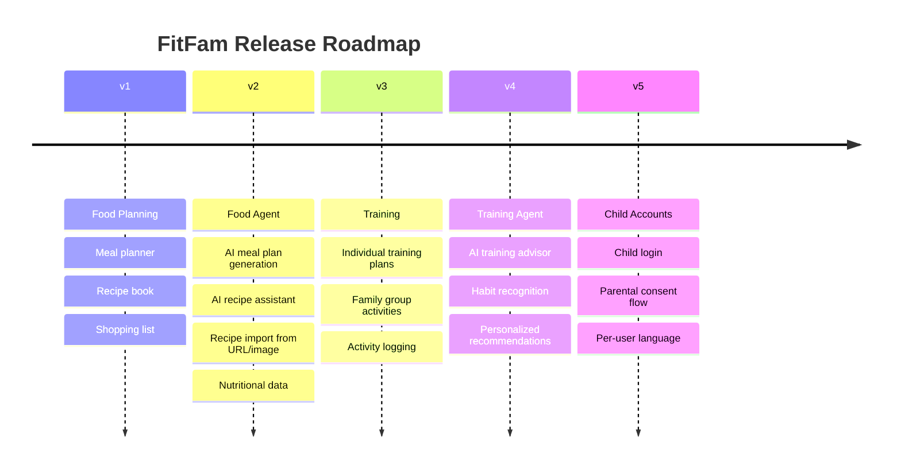

# FitFam — Product Roadmap

## Version Overview

---

## v1 — Food Planning (MVP)

> Core goal: Enable a family to plan meals for the week, manage a recipe book, and generate a shopping list. Available on web and mobile from day one.

### Features

- **Family management**
  - Create a family group
  - Add members as profiles (no account required)
  - Invite adults via email to create their own account
  - Family-level language setting (English / Polish)
  - Member roles: Owner, Adult, Child profile

- **Recipe book**
  - Create, edit, and delete recipes
  - Ingredients with quantity, unit, and category
  - Optional recipe photo
  - Base serving count with proportional ingredient scaling
  - Family ingredient library (reusable across recipes)

- **Meal planner**
  - Weekly view with next-week preview
  - Configurable meal slots (name, time window)
  - Multiple dishes per slot
  - Dish assigned to all or a subset of members
  - Per-member portion count
  - Batch cooking: dish planned across a date range

- **Shopping list**
  - Auto-generated from the weekly meal plan
  - Ingredients aggregated and grouped by category
  - Manual item additions (freeform)
  - Check-off on mobile
  - Offline support for shopping list (mobile)

### Tech introduced in v1

- Nx monorepo, Next.js, Expo, TypeScript
- Clerk authentication
- PostgreSQL (Neon) + Drizzle ORM
- TanStack Query
- shadcn/ui (web)
- next-intl + expo-localization (EN + PL)
- UploadThing + MinIO
- Docker Compose local dev environment

---

## v2 — Food Agent

> Core goal: Add AI assistance to all food features. Introduce the paid subscription tier.

### Features

- **AI meal plan generation** — suggest a weekly meal plan based on family preferences and dietary goals
- **AI recipe assistant** — help create new recipes, suggest variations
- **Recipe import from URL** (premium) — parse a recipe from any webpage and add it to the family book
- **Recipe import from image** (premium) — extract a recipe from a photo (handwritten or printed)
- **Nutritional data** — calories and macros per recipe/dish, powered by AI or external food database
- **Recipe share-by-link** — generate a read-only public URL for a recipe
- **Copy / template week** — copy last week's plan as a starting point
- **Push notifications** — shopping list updates, meal plan ready alerts
- **Stripe billing** — subscription management for AI and premium features

### Tech introduced in v2

- Vercel AI SDK
- Stripe (billing)
- Expo Notifications (push)
- External food database integration (Open Food Facts / Edamam — optional)

---

## v3 — Training

> Core goal: Add family fitness planning alongside food planning.

### Features

- **Individual training plans** — schedule gym sessions, running, cycling per family member
- **Family group activities** — plan shared activities (walks, bike trips, etc.)
- **Weekly activity view** — combined view of meals and activities in one planner
- **Activity logging** — mark planned activities as completed or skipped
- **Activity history** — view past activity completion per member

---

## v4 — Training Agent

> Core goal: Add AI assistance to all training features.

### Features

- **AI training advisor** — suggest training plans per member based on goals and history
- **Habit recognition** — identify patterns in family activity (e.g. consistently skipping Mondays)
- **Personalized recommendations** — align food and training plans with health/fitness goals
- **Equipment suggestions** — gym equipment recommendations and substitutions

---

## v5 — Child Accounts

> Core goal: Allow children to have their own authenticated accounts with age-appropriate access.

### Features

- **Child login** — children can sign in with their own credentials
- **Parental consent flow** — owner approves child account creation
- **Age-gating** — COPPA-compliant flows for under-13 accounts
- **Per-user language** — individual language preference overriding the family default
- **Ingredient internationalization** — multi-language ingredient names

---

## Future Considerations (Unscheduled)

- Community recipe library — browse and import recipes from other FitFam families
- Home inventory and food waste tracking
- Full offline mode (beyond shopping list)
- External food database integration for ingredient pre-fill
- Per-user language override (before or alongside v5)
