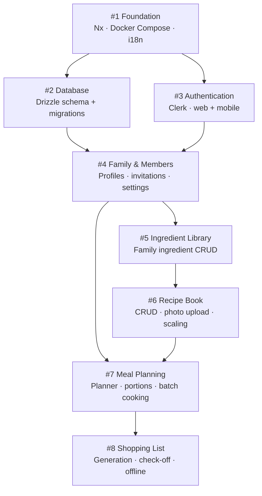

# FitFam v1 — GitHub Issues

All issues are tracked on [je3yk/fit-fam](https://github.com/je3yk/fit-fam/issues).

## Dependency graph

## Issues

| # | Title | Blocked by |
|---|---|---|
| [#1](https://github.com/je3yk/fit-fam/issues/1) | Foundation — Nx monorepo, Docker Compose, i18n | — |
| [#2](https://github.com/je3yk/fit-fam/issues/2) | Database — Drizzle schema and migrations | #1 |
| [#3](https://github.com/je3yk/fit-fam/issues/3) | Authentication — Clerk on web and mobile | #1 |
| [#4](https://github.com/je3yk/fit-fam/issues/4) | Family & Members — profiles, invitations, settings | #2, #3 |
| [#5](https://github.com/je3yk/fit-fam/issues/5) | Ingredient Library — family ingredient CRUD | #4 |
| [#6](https://github.com/je3yk/fit-fam/issues/6) | Recipe Book — CRUD, photo upload, scaling | #5 |
| [#7](https://github.com/je3yk/fit-fam/issues/7) | Meal Planning — planner, portions, batch cooking | #4, #6 |
| [#8](https://github.com/je3yk/fit-fam/issues/8) | Shopping List — generation, check-off, offline | #7 |
